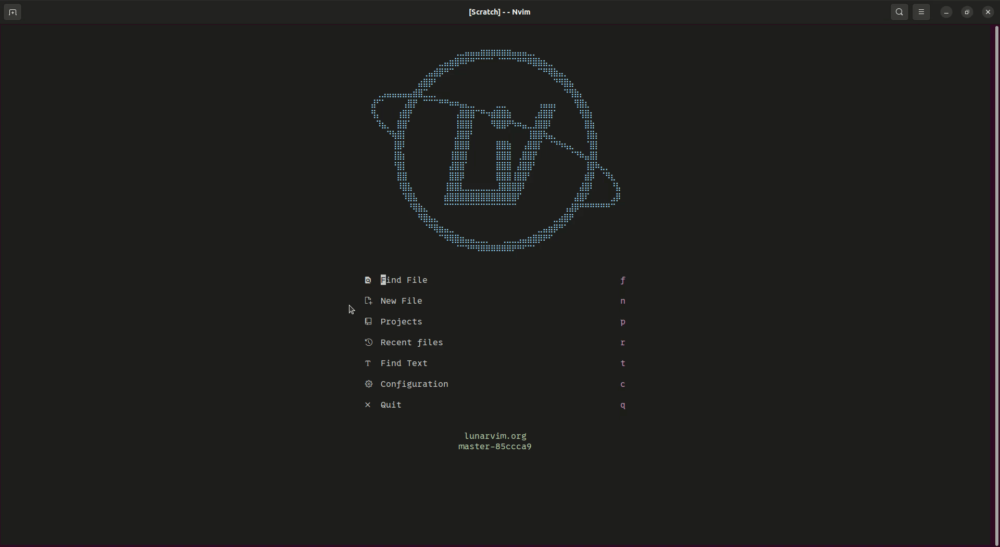

# Description

None of the session plugin I tried work (they all fucked up nvim-tree). So I did the only reasonnable thing to do...\
Ask the plugin's contributors ? Pfff; is that weakness that I see ? (it goes without saying, /j /s)

This plugin does two things,
- Using the Ctrl+s command, it saves the opened files in a .session file
- Using the Ctrl+r command, it restore the last session (opened files, nvimtree and terminal buffer)


*Ctrl+r command*

# Installation

## Requirements

- Neovim >= 0.7
- [nvim-tree.lua](https://github.com/nvim-tree/nvim-tree.lua)
- [toogleterm.nvim](https://github.com/akinsho/toggleterm.nvim)

## Configuration

### [Lazy.nvim](https://github.com/folke/lazy.nvim)

```lua
{ "Akutchi/session.nvim" }
```

To create the key binding, copy/paste this in your config.lua file, or wherever your config is :
```lua
vim.keymap.set('n', "<C-s>", "<cmd>lua require('session').SessionSave()<cr>", { noremap = true })
vim.keymap.set('n', "<C-r>", "<cmd>lua require('session').SessionRestore()<cr>", { noremap = true })
```
